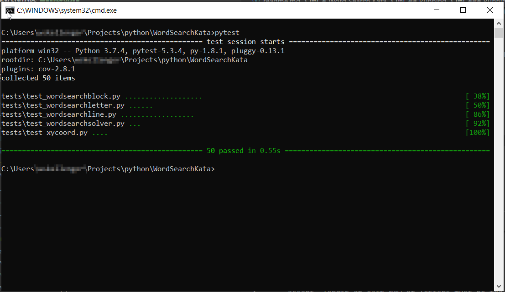
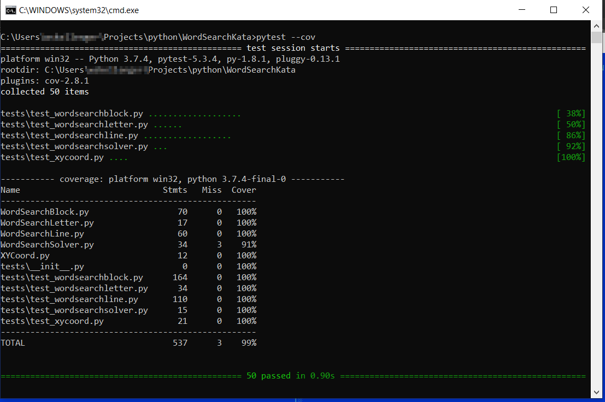
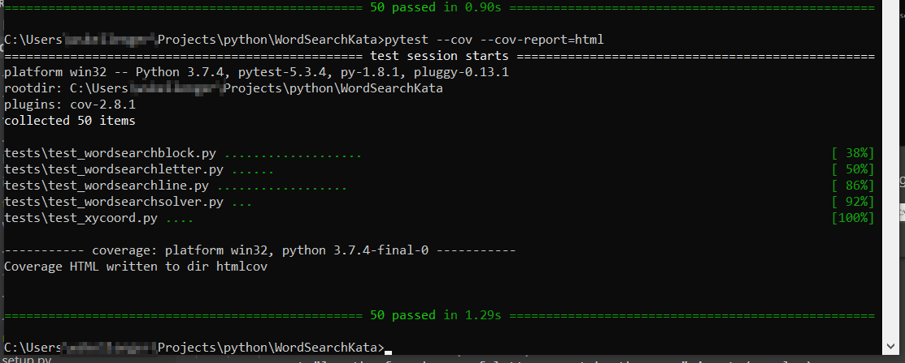

# Word Search Kata

## About
See: https://github.com/PillarTechnology/kata-word-search

## Requirements
Python 3.x (Python 3.7 was used for development)
pytest
pytest-cov

## Running
You can import WordSearchSolver in your project, or you can run WordSearchSolver.py from the commandline:
```WordSearchSolver.py <filename>```

The test case "carparts_hard_from_pdf.txt" is taken from https://www.brainzilla.com/media/wordsearch/pdfs/car-parts-hard.pdf, after which a copule of simple regex replacements in vim were used to put it into the correct format.

### Running Tests
I usually use the built-in unittest framework that Python offers, but for this exercise I decided to try out pytest.  

Install pytest with pip:  pip install pytest

And then just run pytest:
```pytest```



To get coverage, you can do:
```pytest --cov```



For a nice html report of each line of coverage:
```pytest --cov --cov-report=html```

